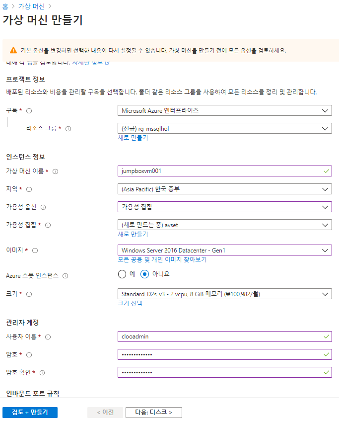

# ADSHandsOn
Azure SQL Database HOL 진행을 위해  
테스트용 VM 배포 및 SSMS (SQL Server Management Studio) 다운로드 및 설치를 진행 합니다

### 01. Azure VM 생성
여러 테스트 환경(mac, windows...)을 일괄적으로 통일 시키기 위해서 azure 상에서 VM을 생성하고 해당 VM에 MSSQL client Tool(SSMS)를 설치하여 HOL진행을 합니다.



생성된 vm resource를 클릭해보면 공용 IP 주소라고 되어있는 부분을 통해 원격접속 합니다.

### 02. Client Tool(SSMS) 설치
자동 설치  
생성된 VM 접속 후 Powershell 

```powershell
# SQL Server Management Studio 설치
[Net.ServicePointManager]::SecurityProtocol = [Net.SecurityProtocolType]::Tls12
Invoke-WebRequest -Uri "https://aka.ms/ssmsfullsetup" -OutFile .\SSMS-Setup-KOR.exe; 

$Parms = " /Install /Quiet /Norestart /Logs log.txt"
$Prms = $Parms.Split(" ")
& .\SSMS-Setup-KOR.exe $Prms | Out-Null
```

자동 설치 실패 시 수동 설치  
[SSMS](https://docs.microsoft.com/ko-kr/sql/ssms/download-sql-server-management-studio-ssms?view=sql-server-ver15)  

